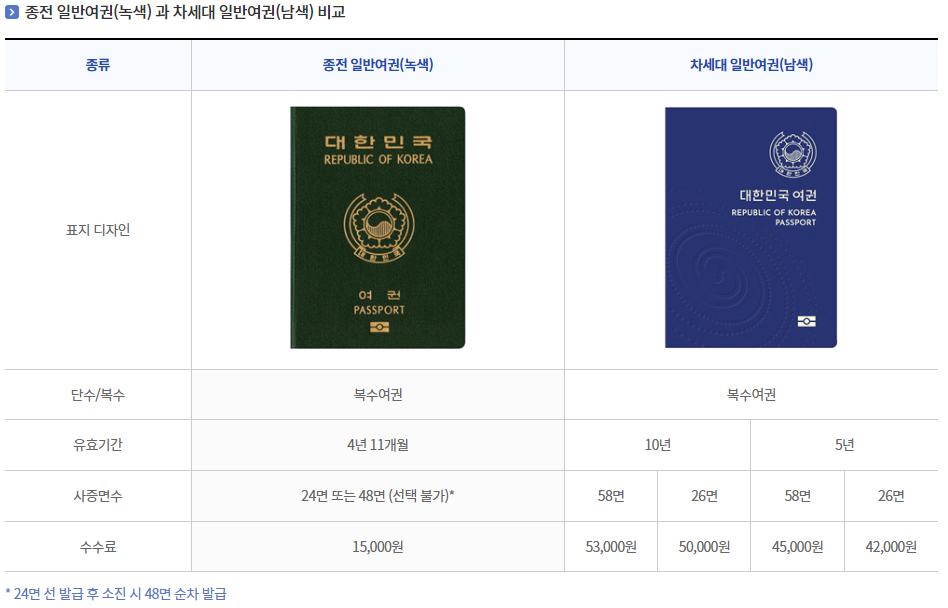

# 일본여행 준비시 유의해야 할 점

## 유의사항 및 수정시간

마지막 수정 시간: 2022.10.28 20:00 Update

본 문서는 일본여행 준비 과정 중 알아야 하는 정보 등을 작성한 문서입니다.
본 문서와 관련된 질문사항은 KAKAOTALK 단체방 혹은 개인 카톡 등으로 문의하시기 바랍니다.
또한, 본 문서의 내용은 다양한 사유로 인해 수정될 수 있으며 주기적으로 확인하시기 바랍니다.

**이 문서의 모든 시간표기는 24시 표기법을 였습니다.**

## 목차

- [1. 기본 정보](#1-기본-정보)
  - [1.1. 항공편](#11-항공편)
  - [1.2. 숙소](#12-숙소)
- [2. 여권과 항공권](#2-여권과-항공권)
  - [2.1. 여권의 영문 이름 표기](#21-여권의-영문-이름-표기)
  - [2.2. 구 여권과 신 여권](#22-구-여권과-신-여권)
  - [2.3. 기내식](#23-기내식)
- [3. 환전](#3-환전)
  - [3.3. 토스는 싸더라](#33-토스는-싸더라)
- [4. 수하물](#4-수하물)
- [5. 가고 싶은 곳](#5-가고-싶은-곳)
- [6. 백신과 PCR 검사](#6-백신과-pcr-검사)
- [7. 로밍과 에그](#7-로밍과-에그)
  - [7.1. 와이파이 에그](#71--에그)

### 1. 기본 정보

#### 1.1. 항공편

> **항공편의 경우 본인 사정 등에 따라 일부 상이할 수 있습니다. 이에 유념하시기 바랍니다.**

**가는 비행기**
날짜: 2023.02.08
출발: 8:50 / 도착: 11:25
출발지: 인천(ICN) / 도착지: 나리타(NRT)
편명: BX146
항공사: 에어부산

**오는 비행기**
날짜: 2023.02.11
출발: 12:25 / 도착: 15:35
출발지: 나리타(NRT) / 도착지: 인천(ICN)
편명: BX163
항공사: 에어부산

#### 1.2. 숙소

숙소명: **UENO MINN**
주소: [〒110-0015 東京都台東区東上野１丁目１９−5](https://goo.gl/maps/hoXs1c6m7Rj9LzAt9)
객실: 디럭스 패밀리 룸

### 2. 여권과 항공권

 여권은 해외 출국시 필수적으로 필요한 신분 증명 수단입니다. 들어가자마자 '아나타 야쿠자데스까? 소레토모 칸코쿠노 조-폭 데스까?' 소리 듣기 싫으면, 필수적으로 챙겨주시고, 아직 발급받지 않으신 경우 최대한 빠르게 발급받아주시기 바랍니다. 또한, 출국 전에 항공권에 여권번호를 기입하여야 하니 이점 유념하여 주시기 바랍니다.

#### 2.1. 여권의 영문 이름 표기

 항공권의 이름 영문 표기와 여권의 이름 영문 표기는 **반드시 동일해야합니다.** 동일하지 않을 시 항공기 탑승 거부, 현지 입국 거부 등의 불이익이 발생할 우려가 있습니다. 현재 예약이 완료된 사람들의 항공권에 기재된 영문 이름 사진을 첨부하오니 참고하시기 바랍니다.
 

#### 2.2. 구 여권과 신 여권

 현재 대한민국 여권은 2021년 기존의 초록색 여권(이하 구 여권)에서 파란색 여권(이하 신 여권)으로 변경되었습니다. 디자인과 개인정보면의 형태 등 일부가 변경되었는데, 자세한 변경사항은 외교부 홈페이지를 참고하시기 바랍니다.

 하지만, 기존에 정부에서 미리 제작해놓은 구 여권의 재고 소진을 위하여, 희망자에 한하여 여권 유효 기간을 4년 11개월로 한정한 대신 낮은 가격에 구 여권을 발급해주고 있습니다. 만약 본인이 [병역미필자](https://www.passport.go.kr/new/board/data.php?idx=6011&sel=1)이거나 기타 사유로 10년짜리 여권이 필요하지 않은 경우, 구 여권의 발급은 경비 절감에 도움이 될 수도 있습니다. 구 여권의 발급은 남은 재고에 한하여 발급되므로, 소진시 발급이 불가하니 구청 여권과에 미리 문의 후 방문하시기 바랍니다.

**[외교부 여권 변경사항 안내 바로가기](https://www.passport.go.kr/new/board/passport_info.php)**
**[여권발급수수료 안내 바로가기](https://www.passport.go.kr/new/issue/commission.php)**

#### 2.3. 기내식

 항공기의 이착륙 시간과 비행시간을 고려하여 기내식을 원한다면 [에어부산 기내식 안내](https://www.airbusan.com/content/common/service/airlineFoodOrder)를 참고하시고, 연락 주시기 바랍니다.

### 3. 환전

 환전은 각자 알아서 하는 것이 원칙입니다. 식사비, 기념품 및 기타 물건 구입비, 교통비 일부(PASS권으로 사용 불가능한 노선의 경우) 등 다양하게 고려하여 적절하게 환전하시기 바랍니다. 참고로, 여행계획은 2023년 1월 즈음에 설계할 예정입니다.

#### 3.3. 토스는 싸더라

 토스에서, 생애 최초 환전의 경우 환전 수수료를 100% 면제해주고 있습니다. 참고로, 보통 시중은행의 경우 환전 수수료 90% 면제를 해 주는 경우가 많습니다.

### 4. 수하물

 현재 에어부산 항공권 기준 위탁수하물(부치는 짐)은 15kg까지 무료이며, 기내반입수하물은 3면의 합이 115cm, 무게 10kg으로 1개 혹은 합산하여 무게 10kg까지인 경우 휴대하여 탑승이 가능합니다. 그 외에, 노트북 전용 가방, 소형 핸드백 등은 이와 상관 없이 휴대하여 탑승 가능합니다. 보따리상마냥 주렁주렁 달고 타는거 아니면 딱히 뭐라 하는건 아니니 참고하시기 바랍니다.
 

### 5. 가고 싶은 곳

 여행계획은 위에서 말한대로 다들 종강/제대 후인 2023년 1월이 되어야 본격적으로 작성할 예정입니다. 원활한 계획 수립 및 만족스러운 여행을 위하여, 각자가 하고 싶은 것, 먹고 싶은 것, 가고 싶은 곳을 찾아본 다음, KAKAOTALK 단체방 내 톡 게시판 `가보고 싶은 곳/해보고 싶은 것` 과 `먹어보고 싶은 것` 게시글에 댓글로 남겨주시기 바랍니다. 여행계획수립은 각자의 의사를 최대한 반영하여 작성하겠으나, 반대로 의사를 제대로 표명하지 않을 시 반영이 어려운 점 유의하시기 바랍니다.

### 6. 백신과 PCR 검사
 
 현재(2022.10.28) 기준으로 일본 정부는 3차 백신 이상의 접종을 완료했고, 이를 증명할 유효한 증명서가 존재할 경우 일본 입국 전 PCR 검사를 면제하고 있습니다. 이에 유의하시기 바라며, 일본 정부의 발표에 주의깊은 관심을 가지고 지켜보시길 바랍니다.
 
 
 ### 7. 로밍과 에그
 
 일본 내에서는 당연하게도, 한국에서 사용하던 요금제를 사용할 수 없습니다. 각자의 요금제에 따라 다르겠지만, 한국에서 이용하듯 현지에서 이용하면 별도의 로밍요금이 부과되며 이는 한국에서의 요금보다 금액이 높습니다. 이에, 현지 USIM 혹은 WIFI 에그의 대여를 권장하며, 아래 대표적인 WIFI 에그의 회사, 가격, 용량과 제한을 소개합니다. 관심 있는 경우 더 알아보시기 바랍니다.
  
 아울러, 이번 여행에서는 에그, USIM 등은 팀 전체가 단체로 대여하는 것이 아닌 각자가 알아서 대여하고 반납하는 방식으로 진행할 예정입니다. 만약 본인의 인터넷 사용량이 많지 않다면, 여행 구성원들 중 1~2명과 함께 공동으로 대여하는 것도 좋은 방법이 될 수 있습니다.
  
 #### 7.1.  에그
 
  WIFI 에그는 이동식 WIFI 공유기라고 생각하면 됩니다. 일일 사용량이 정해져 있으며 해당 사용량을 초과할 경우 속도 제한이 있는 인터넷을 사용할 수 있는 방식입니다. 아래 대표적인 상품을 소개합니다.
  
  **_주의: 가격 등 세부사항은 실제와 다를 수 있습니다. 예약 전 대여사 홈페이지에서 다시 한번 확인하시기 바랍니다._**
  
  |회사|상품명|용량|가격|
|:------:|:---:|:---:|:---:|
|KT|KT 로밍에그|5GB, 초과사용시 1MB/s 속도제한|3300원 / 일|
|WIFI 도시락|WIFI 도시락 2GB|2GB, 초과사용시 512KB/s 속도제한|3300원 / 일|
|WIFI 도시락|WIFI 도시락 10GB|10GB, 초과사용시 1MB/s 속도제한|3300원 / 일|
